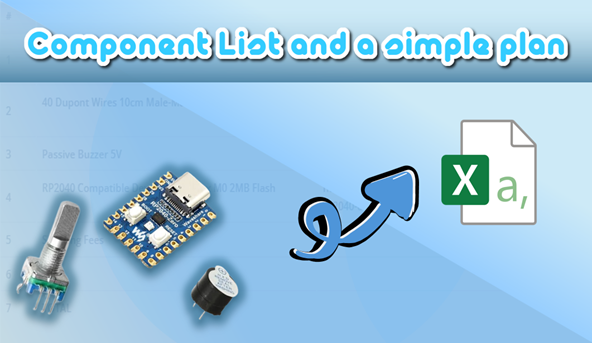

Project: Knoby
Ideea: a simple USB-C Volume Knob with RGB :3

# Devlog 1 : Selecting the Hardware
I did some research for the hardware needed for this project.
Here are my component choices to keep the project as budget friendly as possible:

1. Waveshare Raspberry RP2040: a microcontroller with support for Adafruit TinyUSB, a decent amount of memory and an integrated addressable led
2. Encoder: this will be used to control volume by left-right rotation, mute-unmute by push button, play-pause media by double clicking the push button
3. Jumper Wires: connect the encoder to the microcontroller
4. PWM Buzzer: Provides audible feedback on volume changes and other interactions

Here is a little BOM:
 
| Product Name | Link | Quantity | Price ($) | Total Price ($) |
|---|---|---|---|---|
| Rotary Encoder with Click 20mm EC11 | [link](https://sigmanortec.ro/Encoder-rotativ-cu-click-20mm-EC11-p128736611) | 1 | $0.99 | $0.99 |
| 40 Dupont Wires 10cm Male-Male | [link](https://sigmanortec.ro/40-fire-Dupont-10cm-Tata-Tata-p210856288) | 1 | $1.75 | $1.75 |
| Passive Buzzer 5V | [link](https://sigmanortec.ro/Buzzer-pasiv-5v-p172425809) | 1 | $0.33 | $0.33 |
| RP2040 Compatible Dev Board Cortex M0 2MB Flash | [link](https://sigmanortec.ro/placa-dezvoltare-compatibila-rp2040-cortex-m0-2mb-flash) | 1 | $4.63 | $4.63 |
| Shipping Fees |  |  |  | $3.38 |
 
**TOTAL: $11.08**

So... we're at just ~$11.10 so far, not including any 3D-printed parts considering that I'll be 3D printing everything myself 
 
 